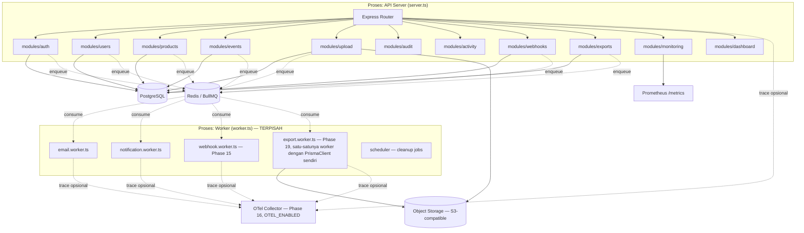

# Architecture Diagram & Overview

## Gaya Arsitektur: Modular Monolith

Proyek ini SATU proses deploy (dua sebenarnya — API server & worker,
lihat di bawah), tapi kode DIPISAH per modul bisnis dengan batas yang
jelas — bukan monolith "semua campur", juga bukan microservices
(tidak ada network call antar modul, semua panggilan fungsi langsung
di proses yang sama).



**Deployment target ganda** (Phase 20) — diagram di atas menggambarkan
topologi PROSES, bukan infrastruktur — lihat `docs/deployment-diagram.md`
untuk bagaimana proses API/worker ini sungguhan di-deploy: VPS+PM2
(`deploy/scripts/deploy.sh`, sudah lama ada) ATAU Kubernetes
(`k8s/`/`helm/`, ditambahkan Phase 20) — dua target BERDAMPINGAN,
bukan satu menggantikan yang lain.

**Kenapa API server & worker proses terpisah** — beban pemrosesan job
(kirim email, dsb) tidak boleh memperlambat response time HTTP.
Keduanya dibangun dari `dist/` yang sama, hanya entry point berbeda
(`server.js` vs `worker.js`), lihat `deploy/pm2/ecosystem.config.js`.

## Lapisan di Dalam Satu Modul

Setiap modul (`src/modules/<nama>/`) mengikuti struktur SAMA:

```
modules/<nama>/
├── <nama>.routes.ts       # definisi endpoint + middleware chain
├── <nama>.controller.ts   # terima Request/Response, panggil Service
├── <nama>.service.ts      # LOGIKA BISNIS — satu-satunya lapisan ini
├── <nama>.repository.ts   # SATU-SATUNYA lapisan yang bicara ke Prisma
├── <nama>.dto.ts           # tipe & skema Zod untuk validasi input/output
└── <nama>.service.spec.ts  # unit test, Repository di-mock
```

**Aturan tegas**: Controller TIDAK PERNAH memanggil Repository langsung
(harus lewat Service), dan Service TIDAK PERNAH mengimpor Prisma Client
langsung (harus lewat Repository). Ini yang membuat unit test Service
bisa 100% mock tanpa database sungguhan — lihat pola di
`auth.service.spec.ts`.

## Shared Layer (`src/shared/`)

Kode yang dipakai LINTAS modul, dikelompokkan per kepentingan:

| Folder | Isi |
|---|---|
| `config/` | env validation (`env.ts`), koneksi DB/Redis/S3/Sentry |
| `middlewares/` | `auth.middleware.ts`, `permission.middleware.ts`, `upload.middleware.ts`, dll |
| `security/` | RBAC (`permissions.ts`), rate limiter (per-IP DAN per-tenant, Phase 18), login-attempt-tracker |
| `queue/` | BullMQ queue definitions (email/notification/webhook-delivery/export), dead-letter queue, metrics, Bull Board dashboard |
| `reliability/` | Timeout/Retry/Circuit Breaker/Bulkhead (Phase 18) — dipakai seluruh provider eksternal (`shared/integrations/*`) |
| `observability/` | OpenTelemetry tracing (Phase 16), correlation ID |
| `utils/` | JWT, hashing, cache, refresh-token, user-agent parser, CSV/XLSX/PDF export generator |
| `scheduler/` | cron-style job (cleanup token kedaluwarsa, dll) |

## Permission System (RBAC)

**Keputusan sadar** (dikonfirmasi ulang di Phase 9 upgrade, lihat
riwayat percakapan implementasi): permission dipetakan lewat **kode**
(`shared/security/permissions.ts`, `ROLE_PERMISSIONS` map), **bukan**
tabel database (`Role`/`Permission`/`RolePermission`). Alasannya:
role masih tertutup & jarang berubah (`USER`/`ORGANIZER`/`ADMIN`) —
menambah 4 tabel + join di setiap request untuk domain permission
yang statis adalah kompleksitas tanpa manfaat proporsional. Kalau
kebutuhan berubah jadi role dinamis per-tenant (custom role yang bisa
dibuat admin), migrasi ke tabel DB baru jadi masuk akal — tapi itu
keputusan arsitektur terpisah, bukan bagian upgrade ini.

## Kenapa Bukan Microservices

Domain bisnis (User, Product, Event, Upload) punya keterkaitan data
erat (mis. `Event.owner` → `User`, semua butuh audit log yang sama)
dan tim pengembang masih satu — microservices akan menambah biaya
operasional (service discovery, distributed tracing, eventual
consistency) tanpa manfaat scaling yang benar-benar dibutuhkan saat
ini. Modular monolith memberi batas kode yang jelas (mempermudah
ekstraksi ke service terpisah NANTI kalau memang perlu) tanpa biaya
operasional itu sekarang.
