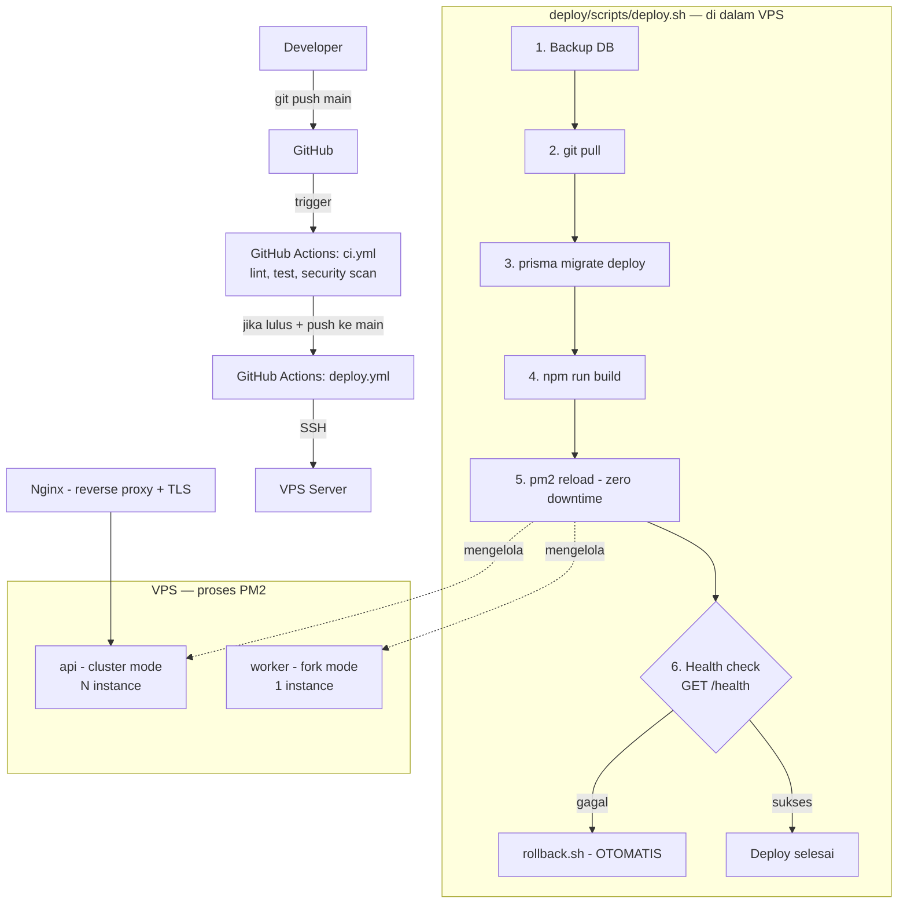

# Deployment Diagram

Dua jalur deployment yang **hidup berdampingan** (bukan satu
menggantikan yang lain) — pilih sesuai target infrastruktur Anda.
Lihat `docs/infrastructure-diagram.md` untuk topologi dependency
eksternal (database, Redis, dst) yang dipakai KEDUA jalur ini.

## Jalur 1 — VPS + PM2 (sudah ada sejak awal)



**Rollback**: `deploy/scripts/rollback.sh` — otomatis dipanggil kalau
health check pasca-deploy gagal, atau manual kapan saja. Lihat
`docs/runbook.md` § Rollback untuk langkah operasional lengkap.

## Jalur 2 — Kubernetes (Phase 20, aditif)

```mermaid
graph TB
    Dev2[Developer/CI] -->|docker build + push| Registry[Container Registry]
    Dev2 -->|helm upgrade| Cluster[Kubernetes Cluster]

    subgraph "Helm Release: backend-foundation"
        Hook[migration-job.yaml<br/>pre-install/pre-upgrade hook] -.jalan LEBIH DULU.-> DeployAPI
        DeployAPI[Deployment: api<br/>track=stable, 3 replika] --> SvcAPI[Service: api]
        DeployWorker[Deployment: worker<br/>2 replika]
        SvcAPI --> Ingress[Ingress - nginx]
        HPA[HPA] -.autoscale 3-10.-> DeployAPI
    end

    Ingress -->|traffic| SvcAPI
    Registry -.image.-> DeployAPI
    Registry -.image sama.-> DeployWorker

    subgraph "Blue-Green (opsional, manual trigger)"
        DeployGreen[Deployment: api<br/>track=green] -.belum terima traffic.-> SvcAPI
        SvcAPI -.switch selector.->|cutover manual| DeployGreen
    end

    subgraph "Canary (opsional, manual trigger)"
        DeployCanary[Deployment: api-canary<br/>track=canary, 1 replika] --> SvcCanary[Service: api-canary]
        SvcCanary --> IngressCanary[Ingress-canary<br/>weight: 0-100]
        IngressCanary -.persentase kecil traffic.-> Ingress
    end
```

**Rollback**: `kubectl rollout undo deployment/backend-foundation-api`
ATAU `helm rollback backend-foundation`. Detail lengkap tiap strategi
(blue-green cutover, canary weight ramping) ada di `k8s/README.md`.

## Perbandingan Cepat

| | VPS + PM2 | Kubernetes |
|---|---|---|
| Kompleksitas operasional | Rendah | Tinggi (butuh cluster, ingress controller, dst) |
| Autoscaling | Manual (tambah instance PM2) | Otomatis (HPA) |
| Zero-downtime deploy | Ya (`pm2 reload`) | Ya (RollingUpdate) |
| Blue-Green/Canary | Tidak tersedia | Tersedia (Phase 20) |
| Rollback otomatis pasca-gagal | Ya (`deploy.sh` built-in) | Manual (`kubectl rollout undo`/`helm rollback`) |
| Cocok untuk | Tim kecil, satu server, biaya rendah | Traffic tinggi/fluktuatif, butuh multi-region |
