# Entity-Relationship Diagram

Mencakup seluruh **19 model** di `prisma/schema.prisma` (Phase 21
audit: sebelumnya dokumen ini menyebut "12 model" dan tertinggal —
`Tenant`, `MfaRecoveryCode`, `ApiKey`, `WebhookEndpoint`,
`FeatureFlag`, `SearchDocument`, `ExportJob` ditambahkan di sini,
plus field MFA/tenant di `User` yang sebelumnya belum tercatat).

> **Koreksi**: versi dokumen ini SEBELUMNYA menulis field `User.passwordHash`
> — field yang benar di schema adalah **`User.password`** (nullable,
> karena akun OAuth-only tidak pernah punya password). Sudah diperbaiki
> di diagram di bawah.

```mermaid
erDiagram
    Tenant ||--o{ User : "punya"
    Tenant ||--o{ Product : "punya"
    Tenant ||--o{ Event : "punya"
    Tenant ||--o{ ApiKey : "punya"
    Tenant ||--o{ WebhookEndpoint : "punya"

    User ||--o{ OAuthAccount : "punya"
    User ||--o{ EmailVerificationToken : "punya"
    User ||--o{ PasswordResetToken : "punya"
    User ||--o{ RefreshToken : "punya sesi"
    User ||--o{ MfaRecoveryCode : "punya (jika MFA aktif)"
    User ||--o{ ApiKey : "punya"
    User ||--o{ WebhookEndpoint : "punya"
    User ||--o{ Product : "membuat"
    User ||--o{ Event : "owner dari"
    User ||--o{ FileUpload : "mengunggah"
    User ||--o{ AuditLog : "tercatat di (opsional)"
    User ||--o{ ActivityLog : "tercatat di (opsional)"
    User ||--o{ ExportJob : "meminta (via userId, tanpa FK - lihat catatan)"
    Product ||--o{ ProductUpgradeLog : "punya riwayat"

    Tenant {
        string id PK
        string slug UK
        string name
        enum status "ACTIVE atau SUSPENDED"
        datetime deletedAt "soft delete"
    }

    User {
        string id PK
        string email UK
        string password "nullable - null untuk akun OAuth-only"
        string name
        enum role "USER, ORGANIZER, atau ADMIN"
        string tenantId FK "nullable - Phase 11, backfill bertahap"
        boolean mfaEnabled
        string mfaSecret "terenkripsi, nullable"
        datetime emailVerifiedAt
        datetime deletedAt "soft delete"
        datetime createdAt
    }

    RefreshToken {
        string id PK
        string userId FK
        string tokenHash UK
        string familyId "Phase 9 - token family untuk reuse detection"
        string userAgent
        string ipAddress
        datetime revokedAt
        datetime expiresAt
    }

    MfaRecoveryCode {
        string id PK
        string userId FK
        string codeHash
        datetime usedAt "null berarti belum dipakai"
    }

    ApiKey {
        string id PK
        string userId FK
        string tenantId FK "nullable"
        string name
        string keyPrefix "8 karakter pertama, ditampilkan di UI"
        string keyHash UK
        string_array scopes
        datetime lastUsedAt
        datetime expiresAt
        datetime revokedAt
    }

    WebhookEndpoint {
        string id PK
        string userId FK
        string tenantId FK "nullable"
        string url
        string secret "untuk HMAC signing payload keluar"
        string_array eventTypes
        boolean active
        datetime revokedAt
    }

    OAuthAccount {
        string id PK
        string userId FK
        string provider "google atau github"
        string providerAccountId
    }

    Product {
        string id PK
        string userId FK
        string tenantId FK "nullable"
        string category
        string status
        datetime deletedAt "soft delete"
    }

    ProductUpgradeLog {
        string id PK
        string productId FK
        string fromCategory
        string toCategory
    }

    Event {
        string id PK
        string ownerId FK
        string tenantId FK "nullable"
        string category
        string location
        datetime date
        datetime deletedAt "soft delete"
    }

    FileUpload {
        string id PK
        string userId FK
        string key UK "S3 object key"
    }

    ExportJob {
        string id PK
        string userId "TANPA FK - lihat catatan desain"
        string tenantId "nullable, TANPA FK"
        enum type "USERS, AUDIT_LOG, atau DASHBOARD_STATS"
        enum format "CSV, XLSX, atau PDF"
        enum status "QUEUED, PROCESSING, COMPLETED, atau FAILED"
        string fileUrl "diisi setelah upload ke object storage sukses"
        datetime completedAt
    }

    AuditLog {
        string id PK
        string userId "opsional, TANPA FK - aksi anonim tetap tercatat"
        enum action
        string entity
        string entityId
        datetime createdAt
    }

    ActivityLog {
        string id PK
        string userId FK "opsional"
        string type
        datetime createdAt
    }

    BlacklistedToken {
        string id PK
        string jti UK
        datetime expiresAt
    }

    FeatureFlag {
        string id PK
        string key UK
        boolean enabled
        string description
    }

    SearchDocument {
        string id PK
        string indexName
        string documentId
        string searchText
        json content
    }
```

## Catatan Desain Kunci

- **Soft delete** (`deletedAt`) dipakai `Tenant`, `User`, `Product`, `Event` —
  data historis (mis. `AuditLog` yang mereferensikan `entityId` lama)
  tetap valid meski record induknya "dihapus". `onDelete: Cascade` di
  relasi lain (`RefreshToken`, `OAuthAccount`, `MfaRecoveryCode`, `ApiKey`, `WebhookEndpoint`) tetap HARD delete
  — sengaja: data itu tidak ada nilai historisnya begitu User benar-
  benar dihapus permanen dari sistem.
- **`AuditLog.userId` dan `ExportJob.userId`/`tenantId` SENGAJA
  TANPA foreign key constraint** — pola yang SAMA dipakai keduanya:
  baris riwayat/audit HARUS tetap ada meski user pembuatnya sudah
  dihapus permanen (bukan ikut ter-cascade-delete), dan tetap bisa
  mencatat aksi yang gagal diautentikasi (mis. percobaan login gagal
  dengan email yang tidak terdaftar sama sekali, di mana `userId`
  memang tidak ada).
- **`RefreshToken.familyId`** (Phase 9) — juga berfungsi sebagai
  representasi "sesi" untuk Session Management (Phase 17), lihat
  `docs/sequence-diagrams.md`. Proyek ini SENGAJA tidak punya tabel
  `UserSession` terpisah — `RefreshToken` per baris SUDAH merepresentasikan
  satu sesi/device (lihat rationale di `prisma/schema.prisma`).
- **`User.tenantId` dan `Product/Event/ApiKey/WebhookEndpoint.tenantId`
  nullable** (Phase 11, Multi Tenancy Foundation) — migrasi bertahap,
  baris lama di-backfill ke tenant default tanpa window downtime
  (lihat `docs/tenant-migration-strategy.md`).
- **`ExportJob`** (Phase 19) — SATU baris per permintaan export,
  status berubah `QUEUED -> PROCESSING -> COMPLETED/FAILED` seiring
  worker BullMQ memprosesnya (lihat `docs/architecture.md` untuk
  topologi worker).
