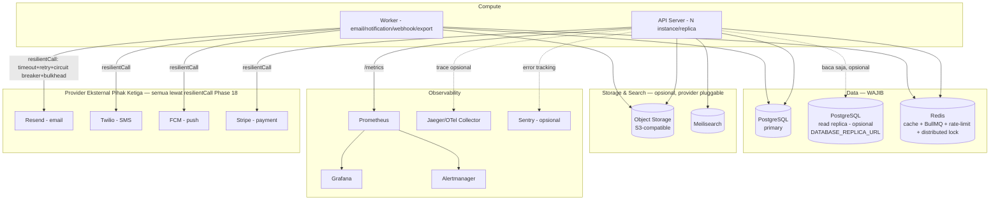

# Infrastructure Diagram

Topologi dependency eksternal — SAMA untuk kedua jalur deployment
(`docs/deployment-diagram.md`), hanya cara proses API/worker
dijalankan yang berbeda antara VPS dan Kubernetes.

## Klasifikasi Kekritisan

| Komponen | Wajib/Opsional | Dampak kalau down |
|---|---|---|
| PostgreSQL primary | **WAJIB** | Total outage — SEMUA endpoint yang menyentuh data gagal |
| Redis | Opsional* | Cache miss (tetap jalan, lebih lambat), queue/worker berhenti (fallback sinkron, lihat Phase 13/19), rate limiter fallback ke in-memory per-instance |
| Object Storage (S3) | Opsional* | Upload/export gagal, fitur lain tetap jalan |
| Meilisearch | Opsional* | Search endpoint gagal, fitur lain tetap jalan |
| Prometheus/Grafana/Alertmanager | Opsional | Kehilangan visibility, TIDAK mempengaruhi aplikasi berjalan |
| Jaeger/OTel Collector | Opsional | Kehilangan trace, TIDAK mempengaruhi aplikasi (span jadi no-op) |
| Sentry | Opsional | Kehilangan error tracking terpusat, aplikasi tetap jalan (log Pino tetap ada) |
| Provider notifikasi (Resend/Twilio/FCM) | Opsional* | Notifikasi gagal terkirim (circuit breaker mencegah cascading failure, Phase 18), operasi inti TIDAK terganggu |
| Stripe | Opsional* | Pembuatan payment intent gagal, TIDAK ada provider lain yang jadi pemblokir alur inti |

\* "Opsional" berarti aplikasi didesain untuk tetap berjalan (graceful
degradation) tanpanya, BUKAN berarti tidak penting untuk fitur yang
bergantung padanya — lihat `docs/runbook.md` untuk prosedur saat salah
satu down.

## Jaringan (Docker Compose)

Seluruh service production (`docker-compose.prod.yml`) berbagi SATU
Docker network (`backend-network`) — Postgres/Redis TIDAK expose port
ke luar network ini (`ports:` hanya didefinisikan untuk service yang
memang perlu diakses dari luar, mis. API di port 3000). Monitoring
stack (`docker-compose.monitoring.yml`) bergabung ke network yang SAMA
lewat `external: true` supaya Prometheus bisa scrape `/metrics`
aplikasi tanpa expose port aplikasi lebih luas dari yang perlu.
