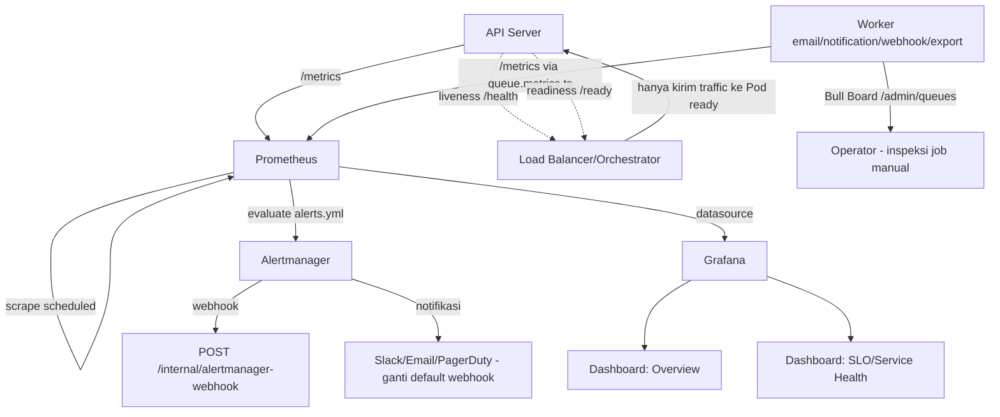

# Monitoring Guide (Prometheus, Grafana, Queue)

## Menjalankan Stack Monitoring

```bash
docker compose -f docker-compose.yml -f docker-compose.monitoring.yml up -d
```

`docker-compose.monitoring.yml` bergabung ke `backend-network` yang
sama lewat `external: true` — supaya Prometheus bisa scrape aplikasi
tanpa expose port aplikasi ke luar Docker network.

## Prometheus

- Scrape target aplikasi: `GET /metrics` (tidak di-versioning, lihat
  `app.ts`) — HTTP request metrics (`http_request_duration_seconds`,
  dst, lewat `metrics.middleware.ts`) DAN queue metrics (Phase 10
  upgrade, lihat bagian Queue di bawah).
- Konfigurasi scrape interval & target: `monitoring/prometheus/prometheus.yml`.
- Akses UI Prometheus: `http://localhost:9090` (default, sesuaikan
  dengan port di compose file Anda).

### Query Berguna

```promql
# p95 response time per endpoint
histogram_quantile(0.95, rate(http_request_duration_seconds_bucket[5m]))

# Error rate (status >= 500)
rate(http_requests_total{status_code=~"5.."}[5m])

# Kedalaman antrian (Phase 10)
queue_jobs_total{queue="email", status="waiting"}

# Worker mati (Phase 10) — 0 berarti heartbeat sudah stale
queue_worker_up{queue="email"} == 0
```

## Grafana

- Provisioning otomatis: `monitoring/grafana/provisioning/` (datasource
  Prometheus + dashboard) — tidak perlu setup manual setelah compose up.
- Login default: `GRAFANA_ADMIN_USER`/`GRAFANA_ADMIN_PASSWORD` (default
  `admin`/`admin` — **WAJIB diganti** sebelum diekspos di luar
  localhost, lihat `.env.example`).
- Akses: `http://localhost:3001` (default Grafana), import dashboard
  ID standar Node.js/Express kalau ingin visualisasi tambahan di luar
  yang sudah di-provision.

## Queue Monitoring (Phase 10, diperluas Phase 15/19)

Empat queue yang dipantau: `email`, `notification`, `webhook-delivery`
(Phase 15), `export` (Phase 19) — plus `dead-letter` untuk job yang
gagal habis-habisan. Dua cara melihat status, untuk kebutuhan berbeda:

| Kebutuhan | Alat | URL |
|---|---|---|
| Trend historis, alerting | Prometheus + Grafana | `/metrics` → scrape berkala |
| Inspeksi job individual, retry/hapus manual | Bull Board | `/admin/queues` |

Bull Board **tidak terpasang otomatis** — lihat `docs/security-guide.md`
untuk alasannya. Aktifkan dengan mengisi `QUEUE_DASHBOARD_USER` &
`QUEUE_DASHBOARD_PASSWORD` di `.env`.

## Health Check vs Metrics — Beda Tujuan

- `GET /health` — **liveness SAJA** (Phase 18) — TIDAK menyentuh
  database/Redis sama sekali, murni "proses Node ini masih hidup".
  Dipakai `livenessProbe` (Kubernetes)/healthcheck Docker untuk
  keputusan restart proses.
- `GET /ready` — **readiness** (Phase 18, terpisah dari `/health`) —
  mengecek koneksi database/Redis/queue, DAN otomatis 503 selama
  graceful shutdown berlangsung (lihat `health.controller.ts`,
  `setShuttingDown()`). Dipakai `readinessProbe`/load balancer untuk
  keputusan "boleh terima traffic baru atau tidak" — SENGAJA endpoint
  TERPISAH dari `/health`: liveness yang salah pakai logic readiness
  akan membuat orchestrator me-restart proses berulang-ulang HANYA
  karena database sempat lambat sesaat, padahal proses Node-nya
  sendiri sehat.
- `GET /metrics` — data time-series untuk analisis tren, BUKAN untuk
  keputusan restart otomatis (terlalu lambat untuk itu; scrape interval
  biasa 15-30 detik).

## Alerting

**Sudah dikonfigurasi** (Phase 13) — koreksi dari versi dokumen ini
sebelumnya yang menyebut alerting "belum dikonfigurasi", sudah tidak
akurat. Prometheus Alertmanager terpasang lengkap di
`docker-compose.monitoring.yml`, dengan rule di
`monitoring/prometheus/alerts.yml`. Detail lengkap (alert yang
tersedia, routing, webhook balik ke aplikasi) ada di
`docs/observability-guide.md` bagian "Alerting" — tidak diduplikasi
di sini supaya tidak ada dua sumber kebenaran yang bisa saling
tertinggal lagi seperti sebelumnya.

## Monitoring Diagram


