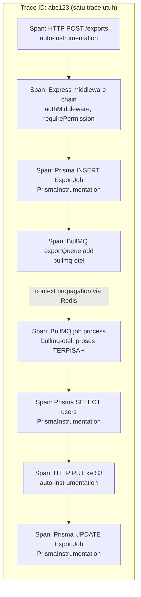

# Observability Guide (Phase 13 + Phase 16 — Distributed Tracing Enterprise)

Ringkasan seluruh alat observability yang tersedia dan cara
mengaktifkannya. Untuk metric/dashboard yang sudah ada sejak fase
sebelumnya (Prometheus, Grafana dasar), lihat `docs/monitoring-guide.md`.
Untuk definisi SLO/error budget, lihat `docs/slo.md`.

## Correlation ID

Setiap request otomatis mendapat satu ID unik (`X-Correlation-ID`,
`shared/observability/correlation-id.middleware.ts`) yang:

- Dipakai ulang kalau caller sudah mengirim header ini sendiri
  (memungkinkan penelusuran lintas-service — ID yang sama mengalir
  dari ujung ke ujung).
- Dikembalikan lewat response header yang sama — client bisa
  melampirkannya saat melaporkan bug.
- Menjadi `req.id` di SETIAP baris log Pino untuk request tersebut
  (lewat `genReqId` di `app.ts`) — cari satu ID ini di log aggregator
  untuk melihat seluruh jejak satu request.
- Tersedia lintas Repository/Service/queue job lewat
  `getCorrelationId()` (AsyncLocalStorage, pola yang sama dengan
  tenant context Phase 11).

Tidak butuh konfigurasi apa pun — selalu aktif.

## Distributed Tracing (OpenTelemetry)

**Opt-in**, default MATI. Aktifkan lewat environment variable:

```bash
OTEL_ENABLED=true
OTEL_SERVICE_NAME=backend-foundation   # opsional, default sudah ini
OTEL_EXPORTER_OTLP_ENDPOINT=http://localhost:4318/v1/traces   # default: Jaeger lokal
```

Dengan `docker-compose.monitoring.yml` (menyediakan Jaeger di port
4318/16686), tidak perlu konfigurasi tambahan apa pun selain
`OTEL_ENABLED=true` untuk mulai melihat trace di
`http://localhost:16686`.

**Yang otomatis ter-instrument** (lewat `@opentelemetry/auto-instrumentations-node`,
lihat `shared/observability/tracing.ts`): HTTP (incoming & outgoing),
Express (routing, middleware), Redis/ioredis, dan instrumentasi bawaan
lain dari paket tersebut. Instrumentasi filesystem SENGAJA dimatikan
(noise, lihat komentar di `tracing.ts`).

**Prisma DAN BullMQ — ter-instrument MANUAL sejak Phase 16** (koreksi
dari versi dokumen ini sebelumnya, yang menyebut keduanya sebagai
keterbatasan — sudah tidak akurat):

- **Query Prisma MENGHASILKAN span tersendiri** lewat
  `@prisma/instrumentation`, didaftarkan eksplisit di `tracing.ts`
  (Prisma tidak termasuk dalam auto-instrumentations-node, harus
  manual). **Prasyarat WAJIB**: `previewFeatures = ["tracing"]` di
  `prisma/schema.prisma` (project masih di Prisma 5.x — baru General
  Availability tanpa flag ini sejak Prisma 6.1) — tanpa preview flag
  ini, instrumentation terpasang tapi TIDAK menghasilkan span sama
  sekali (silent no-op).
- **BullMQ (queue job) TER-INSTRUMENT** lewat `bullmq-otel` (paket
  resmi BullMQ sendiri, BUKAN buatan sendiri), diinjeksikan lewat
  `telemetry: bullMQTelemetry` di SETIAP Queue/Worker
  (`shared/observability/bullmq-telemetry.ts`) — trace request HTTP
  yang men-trigger job (mis. `POST /exports` → job export) SEKARANG
  tersambung ke span pemrosesan job di worker, satu trace utuh dari
  ujung ke ujung. Opt-in mengikuti `OTEL_ENABLED` yang sama (kalau
  mati, `bullMQTelemetry` bernilai `null`, tidak ada overhead span
  sama sekali).

**CATATAN OVERLAP DENGAN SENTRY** — `@sentry/node` (sudah dipakai
sejak sebelum Phase 13) MEMBAWA OpenTelemetry-nya sendiri secara
internal untuk fitur tracing Sentry. Kalau `OTEL_ENABLED=true` DAN
`SENTRY_DSN` diisi BERSAMAAN, keduanya bisa saling meng-instrument
modul yang sama secara independen — tidak fatal, tapi berpotensi span
dobel/membingungkan saat debugging. **Rekomendasi**: pilih SATU jalur
tracing per environment:
- Sudah pakai Sentry dan cukup dengan tracing bawaannya → biarkan
  `OTEL_ENABLED=false` (default).
- Butuh trace detail di Jaeger/Tempo/vendor APM lain → aktifkan
  `OTEL_ENABLED=true`, pertimbangkan menonaktifkan tracing Sentry
  (`tracesSampleRate: 0` di `shared/config/sentry.ts`) supaya tidak
  dobel.

**Versi dependency OpenTelemetry SENGAJA dikunci ke rentang tertentu**
(lihat `package.json`) — dipilih spesifik supaya kompatibel dengan
versi OpenTelemetry yang sudah dibawa `@sentry/node` (peer dependency
`@opentelemetry/core` versi berbeda antar rilis OTel menyebabkan
konflik `ERESOLVE` npm kalau tidak diselaraskan). JANGAN upgrade paket
`@opentelemetry/*` satu-satu tanpa mengecek ulang kompatibilitas
seluruh rentangnya.

## Log ↔ Trace Correlation

Setiap baris log Pino otomatis menyertakan `trace_id`/`span_id` kalau
ada span OpenTelemetry aktif saat log itu ditulis (`shared/logger.ts`,
lewat `mixin()`). Kalau `OTEL_ENABLED=false`, field ini otomatis tidak
muncul (bukan error) — cek `trace_id` di log, cari ID yang sama di
Jaeger UI untuk melihat span lengkapnya.

## Alerting (Prometheus + Alertmanager)

Prometheus mengevaluasi alert rule (`monitoring/prometheus/alerts.yml`)
dan mengirim yang firing ke Alertmanager (`http://localhost:9093`),
yang mengurus grouping/routing/dedup ke channel notifikasi
(`monitoring/alertmanager/alertmanager.yml` — default webhook,
GANTI sebelum production, lihat komentar di file itu).

Alert yang sudah tersedia: `ErrorBudgetBurnFast`/`ErrorBudgetBurnSlow`
(lihat `docs/slo.md`), `LatencyP95AboveSLO`, `ServiceDown`, `RedisDown`,
`PostgresDown`.

Alertmanager juga mengirim webhook ke aplikasi sendiri
(`POST /api/v1/internal/alertmanager-webhook`,
`modules/monitoring/alerts/`) — mencatat setiap alert firing/resolved
ke Pino (dan otomatis ke log aggregator production), supaya alert
operasional tercatat di tempat yang sama dengan log aplikasi lainnya.
Endpoint ini internal (tidak diekspos ke luar `backend-network`), bisa
diproteksi tambahan lewat `ALERTMANAGER_WEBHOOK_SECRET`.

## Dashboard

- `Backend Foundation — Overview` (sejak fase sebelumnya) — request
  rate, error rate, latency, resource usage, status Redis/Postgres.
- `Backend Foundation — SLO / Service Health` (Phase 13, baru) —
  availability SLI, error budget remaining, burn rate, latency vs
  target SLO. Lihat `docs/slo.md` untuk penjelasan tiap panel.

Keduanya auto-provisioned — muncul otomatis di Grafana
(`http://localhost:3001`) begitu `docker-compose.monitoring.yml` up,
tanpa import manual.

## Menjalankan stack observability lengkap

```bash
docker compose up -d                              # stack utama
docker compose -f docker-compose.monitoring.yml up -d   # Prometheus, Grafana, Alertmanager, Jaeger, exporters
```

| Alat | URL |
|---|---|
| Prometheus | http://localhost:9090 |
| Grafana | http://localhost:3001 |
| Alertmanager | http://localhost:9093 |
| Jaeger UI | http://localhost:16686 |

## Tracing Diagram

Contoh satu trace utuh untuk `POST /exports` (Phase 19) saat
`OTEL_ENABLED=true` — request HTTP sampai job worker selesai, SATU
trace ID yang sama dari ujung ke ujung:



Span E-H terjadi di **proses worker terpisah** (`worker.ts`, container
berbeda), tapi tetap masuk trace ID yang SAMA — inilah nilai
`bullmq-otel`: context trace ikut "menumpang" lewat payload job BullMQ
di Redis, bukan terputus begitu request HTTP selesai dan job baru
mulai diproses beberapa detik/menit kemudian.

Lihat trace ini secara visual: Jaeger UI (`http://localhost:16686`,
cari berdasarkan `trace_id` yang sama dengan yang muncul di log Pino —
lihat "Log ↔ Trace Correlation" di atas).
