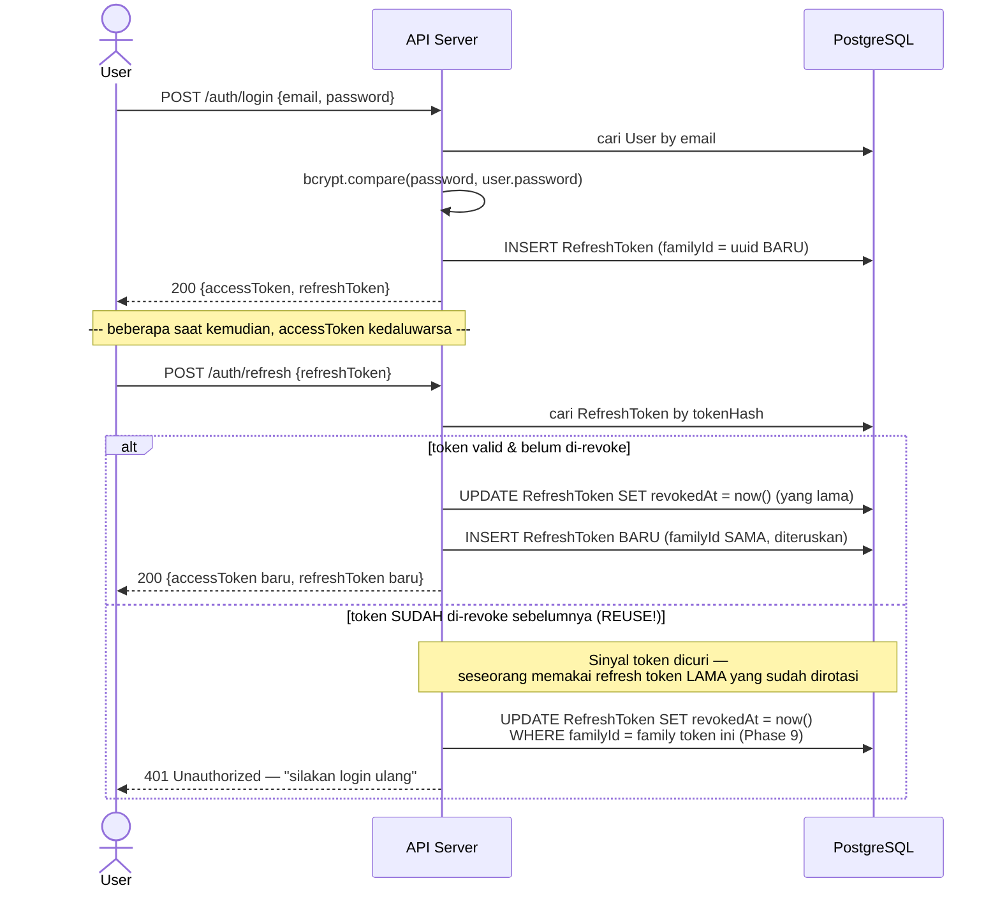
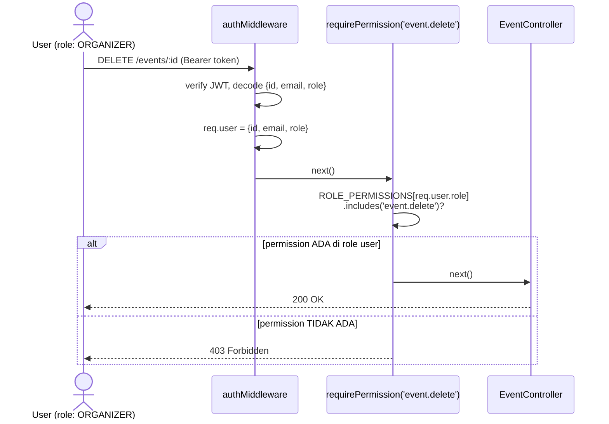
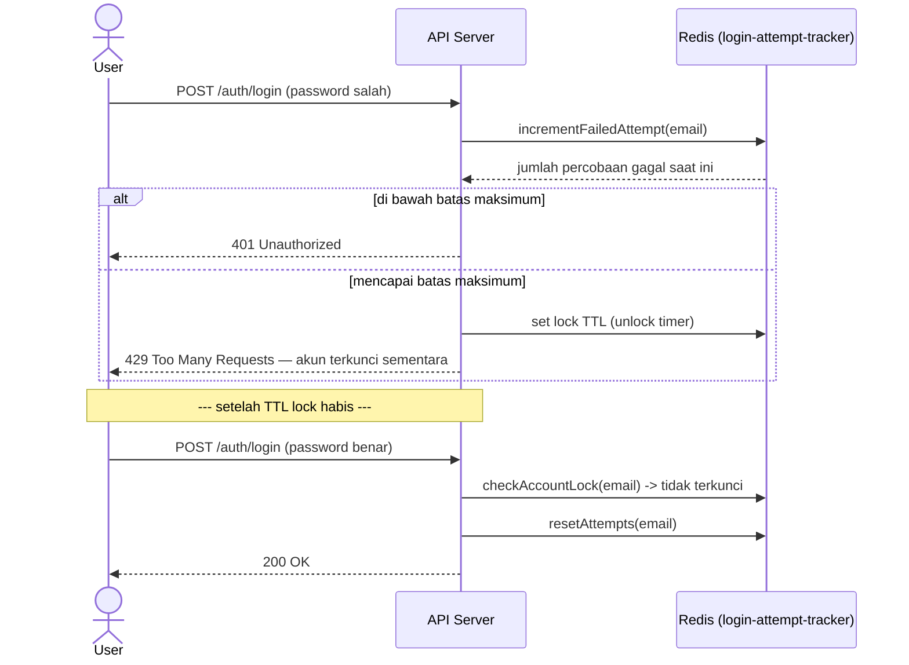
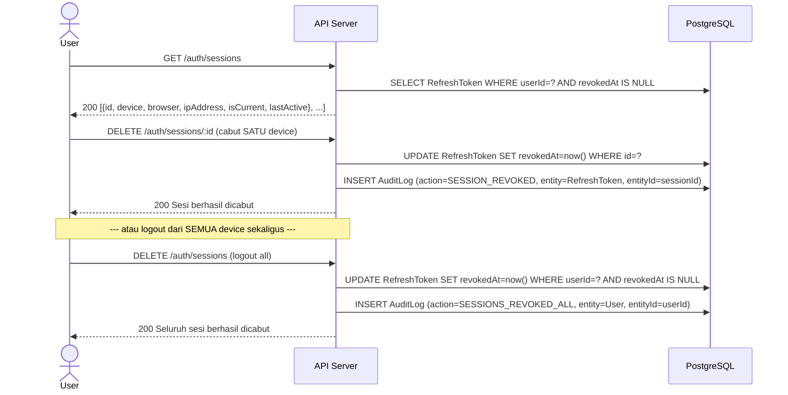
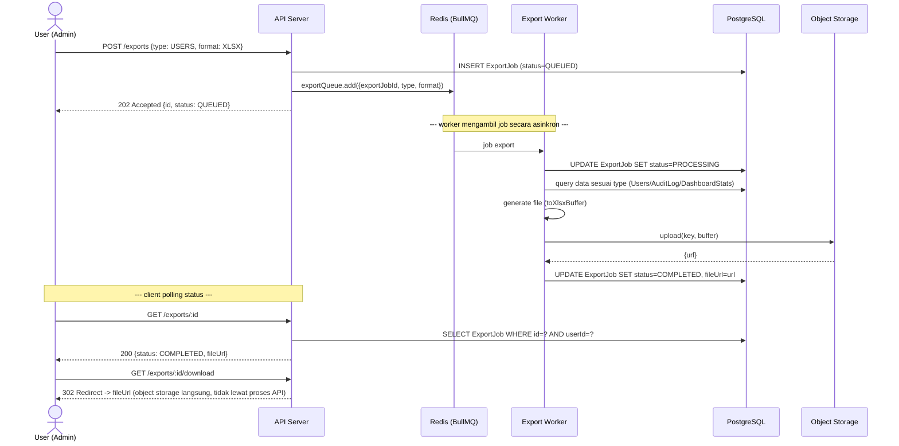

# Sequence Diagrams — Authentication & Authorization

## 1. Login → Refresh (Rotasi) → Reuse Detection

**Kenapa hanya family yang dicabut, bukan seluruh sesi user** (Phase 9
upgrade) — lihat komentar lengkap di `prisma/schema.prisma` field
`RefreshToken.familyId`: reuse pada SATU device tidak boleh ikut
melogout device lain yang sah dan tidak terlibat.

## 2. Authorization (RBAC) — `requirePermission()`

`ROLE_PERMISSIONS` (kode, bukan tabel DB — lihat `docs/architecture.md`
untuk alasannya) didefinisikan di `shared/security/permissions.ts`.

## 3. Login Gagal → Account Lockout

## 4. Session Revocation & Audit Trail (Phase 17)

Catatan: `SESSION_REVOKED`/`SESSIONS_REVOKED_ALL` muncul di riwayat
yang sama dengan `GET /auth/login-history` (filter action-nya
diperluas mencakup keduanya) — satu sumber kebenaran untuk seluruh
riwayat keamanan akun, bukan endpoint terpisah.

## 5. Export Asynchronous via BullMQ (Phase 19)

Fallback (`REDIS_URL` tidak dikonfigurasi): langkah "worker mengambil
job secara asinkron" di atas TIDAK terjadi — `ExportService`
memproses `processExportJob` secara SINKRON di request `POST /exports`
yang sama (respons 202 tetap sama bentuknya, tapi database sudah
`COMPLETED` sebelum response dikirim). Lihat `export.service.ts`.
